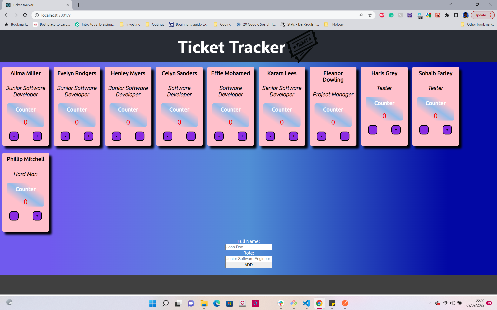

# Ticket Tracker project in React App

<h1 align="center">Hi 👋, I'm Connel</h1>
<h3 align="left">Connect with me:</h3>

<h3 align="left">Languages and Tools:</h3>

    

## Project outline

The outline of this project was to create a ticket tracking system where each employee can keep a count of all tickets, and can also track co-worker's tickets. each employee should also be able to increment/decrement their ticket
count 

This project was created in react using jsx and scss for the logic and styling

## How to work ticket tracker

To use the ticket tracker click on the + button to increase the ticket count on said employee and the - button to decrease the ticket count

To add a new employee fill out the form at the bottom of the page with the employee's name and role and a new card will be generated

## Specific features

A feature contained in my ticket tracker that I am proud of accomplishing is the change of colour for the ticket number once it gets passed a certain threshold and also the ability to add new users to the ticket. both these features were done by using state and passing down functions as props to specific elements via components.

## Things I could add/do better

I would like to add a feature that could enable the user to filter and or search for a specific ticket card or a selection of cards based on role. also a feature where you can delete a card that's been rendered individually.
